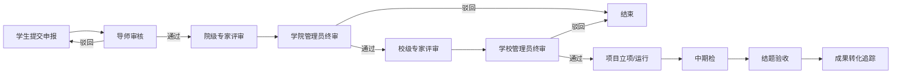

# 高校创新项目系统PRD

## 产品需求文档 \(PRD\)

---

## 文档信息

|项|内容|
|---|---|
|**文档版本**|V1\.0|
|**编制人**|产品团队|
|**编制日期**|2024\-04\-19|
|**审核人**|教务处 / 创新创业学院|
|**状态**|初稿|

---

## 1\. 产品概述

### 1\.1 项目背景

当前高校创新创业项目管理普遍存在以下痛点：

1. **信息孤岛**：申报、评审、过程管理、成果统计分散在不同的 Excel 表格和线下流程中，数据无法互通。

2. **流程冗余**：多级审批依赖线下签字，流转周期长，学生和老师反复跑腿。

3. **监管缺失**：项目立项后缺乏有效的过程跟踪，中期检查流于形式，无法及时预警项目风险。

4. **统计困难**：年底汇总数据时，管理员需要手动从多个渠道收集数据，效率低且易出错。

为解决上述问题，我们计划打造一套覆盖项目全生命周期的线上化管理系统。

### 1\.2 产品定位

**高校学生创新创业项目孵化管理系统**是一套聚焦项目全生命周期管理的数字化平台。
它旨在通过线上化的申报、评审、跟踪与成果管理，打通校院两级管理数据壁垒，实现对创新项目的动态监管与智能预警，从而提升管理效率，助力更多优秀项目成功孵化。

### 1\.3 业务目标

|目标|衡量指标|
|---|---|
|流程提效|将项目申报审批周期从平均 15 天缩短至 5 天|
|数据透明|实现项目数据 100% 线上化，消除线下数据孤岛|
|风险预警|项目逾期预警覆盖率达到 95% 以上|
|决策支持|支持管理层实时查看全校项目数据，决策响应时间从周级缩短至分钟级|

---

## 2\. 目标用户与角色

本系统面向五类核心用户，不同角色拥有不同的功能权限：

|角色|用户画像|核心痛点|核心诉求|
|---|---|---|---|
|**学生 \(Student\)**|参与大创项目的本科生 / 研究生|申报流程繁琐，项目进度不透明|一键提交申报材料，实时查看审核进度|
|**指导老师 \(Teacher\)**|负责指导学生项目的校内教师|审核材料繁琐，难以跟踪项目进展|在线审核申报书，随时查看学生项目进度|
|**学院管理员 \(College Admin\)**|各学院负责双创工作的行政老师|本院项目统计困难，评审组织麻烦|一键汇总本院项目，在线组织院级评审|
|**学校管理员 \(School Admin\)**|校教务处 / 双创学院管理人员|全校数据汇总难，监管难度大|全局数据看板，跨学院数据对比分析|
|**评审专家 \(Expert\)**|校内外评审专家|评审材料分散，线下打分麻烦|在线查看项目材料，在线打分与评语|

---

## 3\. 核心业务流程

## 4\. 功能需求详情

### 4\.1 模块一：在线申报管理

#### 4\.1\.1 功能描述

支持学生在线填写项目申报信息，组建团队，上传申报材料，并提交审核。系统自动校验材料格式与完整性。

#### 4\.1\.2 功能点

- **表单填写**：

    - 支持填写项目名称、类别、所属学院、申请经费、起止时间

    - 支持富文本编辑项目简介、创新点、技术路线

    - 支持动态预算明细录入（可自定义预算科目）

- **团队管理**：

    - 支持通过学号搜索添加团队成员

    - 自动校验成员身份（必须为本校在校学生）

    - 限制同一学生同期参与项目数量（最多 2 项）

- **材料上传**：

    - 支持上传申报书、推荐信等附件

    - 自动校验文件格式（仅支持 PDF/Word）与大小（限制 10MB）

    - 文件存储至对象存储，保证安全

- **草稿箱**：

    - 支持自动保存草稿，学生可分多次填写，无需一次性完成

### 4\.2 模块二：多级评审管理

#### 4\.2\.1 功能描述

实现校院两级的线上评审流程，专家在线打分，系统自动汇总分数并推进流程。

#### 4\.2\.2 功能点

- **专家分配**：

    - 管理员可根据项目研究方向，自动 / 手动匹配相关领域专家

- **在线评审**：

    - 专家可在线查看项目申报材料

    - 提供标准化打分表：

        - 创新性 \(0\-25 分\)

        - 可行性 \(0\-25 分\)

        - 团队情况 \(0\-25 分\)

        - 应用价值 \(0\-25 分\)

    - 支持富文本填写评审意见

- **自动流转**：

    - 当该阶段所有专家均完成打分后，系统自动将项目状态推进至下一审批环节，无需人工干预

    - 自动计算专家平均分，作为排序依据

- **评审回避**：

    - 自动回避项目负责人所在学院的专家，保证评审公平

### 4\.3 模块三：进度可视化跟踪

#### 4\.3\.1 功能描述

对立项后的项目进行过程管理，通过里程碑机制跟踪进度，自动预警风险。

#### 4\.3\.2 功能点

- **里程碑管理**：

    - 学生可根据项目计划，设置多个里程碑节点（如：需求分析、开发完成、论文撰写）

    - 每个节点包含计划完成时间

- **进度更新**：

    - 学生可定期更新里程碑状态（待办 / 进行中 / 已完成）

    - 上传阶段性报告

- **智能预警**：

    - 系统每日自动扫描，对即将到期（3 天内）的里程碑自动发送提醒

    - 对已逾期的里程碑自动标记为 “预警” 状态，并通知负责人与导师

- **进度看板**：

    - 以甘特图形式可视化展示项目整体进度，一目了然

### 4\.4 模块四：成果转化追踪

#### 4\.4\.1 功能描述

跟踪项目产出的成果，涵盖专利、论文、软件著作权、竞赛获奖、商业落地等多种类型。

#### 4\.4\.2 功能点

- **多类型成果录入**：

    - **专利**：支持录入申请号、申请人、发明人等信息

    - **论文**：支持录入期刊、影响因子、作者等信息

    - **软件著作权**：支持录入登记号

    - **竞赛获奖**：支持录入赛事名称、获奖等级

    - **商业落地**：支持录入公司名称、融资情况

- **证明材料**：

    - 支持上传专利受理通知书、论文录用通知等证明材料

- **成果统计**：

    - 自动汇总项目成果，计算成果转化率

    - 支持按成果类型进行分类统计

### 4\.5 模块五：数据统计与分析

#### 4\.5\.1 功能描述

为管理层提供多维数据统计与可视化分析，辅助决策。

#### 4\.5\.2 功能点

- **多维报表**：

    - 按**年份**：统计历年申报数、立项数、成功率

    - 按**学院**：对比各学院的项目参与度与成果产出

    - 按**学科**：分析不同学科的项目分布

- **可视化大屏**：

    - 全校项目总览看板

    - 实时展示申报趋势、立项率、成果转化率

- **数据导出**：

    - 支持将统计数据导出为 Excel 报表，用于上报材料

---

## 5\. 非功能需求

### 5\.1 性能需求

- 页面加载时间：\&lt; 2s

- 接口响应时间：\&lt; 500ms

- 支持同时在线用户：1000 人

- 支持最大文件上传：100MB

### 5\.2 安全需求

- 身份认证：采用 JWT Token 认证，超时自动退出

- 权限控制：严格的 RBAC 权限控制，学生仅能查看自己的项目，学院管理员仅能查看本院数据

- 数据加密：用户密码采用 BCrypt 加密存储

- 文件安全：所有附件采用私有存储，下载时生成临时授权 URL，防止泄露

## 

|      |      |      |
| ---- | ---- | ---- |
|      |      |      |
|      |      |      |
|      |      |      |
|      |      |      |
|      |      |      |
|      |      |      |
|      |      |      |
|      |      |      |
|      |      |      |
|      |      |      |
|      |      |      |